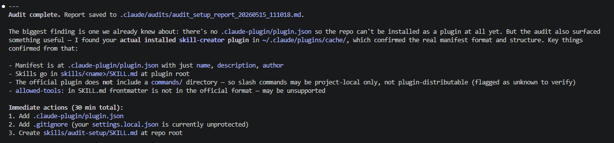
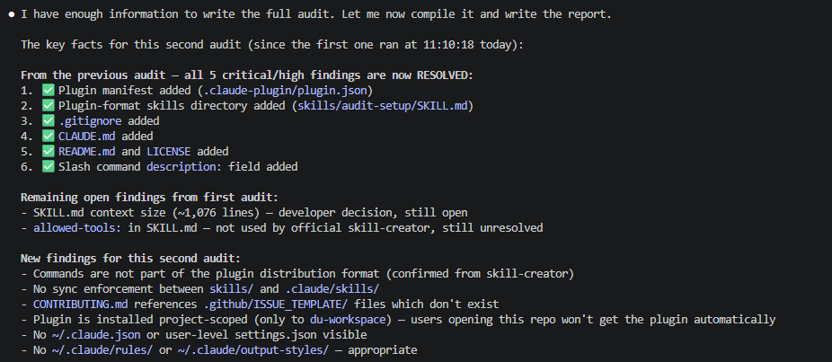
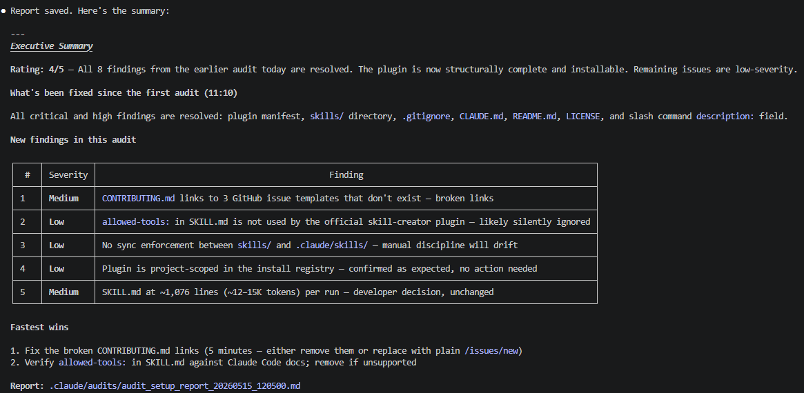

# claude-code-audit

A Claude Code plugin with audit skills for inspecting Claude Code project setups.

## Available skills

| Skill | Description | Status |
|---|---|---|
| `audit-setup` | Audits a project's Claude Code configuration — context architecture, CLAUDE.md correctness, agents, skills, commands, tool selection, performance, usage-limit efficiency, and privacy. Writes a timestamped Markdown report. | stable |

## Install

### Via plugin (once published to marketplace)

```
/plugin install claude-code-audit
```

### Local development / testing against your projects

```
cd /path/to/your-project
claude --plugin-dir /path/to/claude-code-audit
```

Then use `/audit-setup` inside the Claude Code session.

## Usage

```
/audit-setup
/audit-setup focus on context architecture and CLAUDE.md correctness
/audit-setup check usage-limit controls and model routing
```

The skill writes a full audit report to `.claude/audits/audit_setup_report_<timestamp>.md` in the audited project.

## Sample output

The `sample_reports/` directory contains two anonymised audit reports generated on this repo itself during initial plugin development — one at the start (rating 2/5, critical blockers found) and one after those blockers were resolved (rating 4/5, only low-severity issues remaining).

### Run 1 — first audit complete

Audit complete, critical findings identified (no manifest, no `skills/` directory, no `.gitignore`):



Full report: [`sample_reports/audit_setup_report_sample_1.md`](sample_reports/audit_setup_report_sample_1.md)

### Run 2 — follow-up audit

Pre-report analysis showing progress: all critical/high findings resolved, new low-severity findings surfaced:



Executive summary with findings table:



Full report: [`sample_reports/audit_setup_report_sample_2.md`](sample_reports/audit_setup_report_sample_2.md)

---

## Contributing

See [CONTRIBUTING.md](.github/CONTRIBUTING.md). All changes go through PRs — direct pushes to `main` are disabled.

## License

MIT — see [LICENSE](LICENSE).
